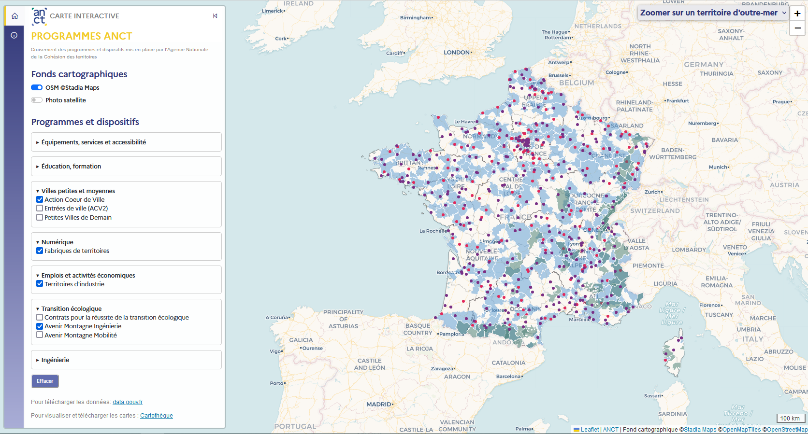

## Carte interactive des programmes de l'ANCT

Page officielle : https://agence-cohesion-territoires.gouv.fr/

Lien direct : https://carto.pages.sit.incubateur.tech/superposeur-anct/

## Présentation

La carte interactive des programmes de l'ANCT recense les dispositifs et programmes accompagnés par l'ANCT pour construire les politiques publiques.

## Fonctionnalités 

- Rechercher, localiser et accéder aux propriétés des programmes ANCT;

## Données

Les données seront diffusées sous licence Ouverte Étalab 2.0 sur la page data.gouv de l'ANCT. 

## Technologies

Cet outil, conçu et développé par le service cartographie de l'ANCT, a été réalisé en HTML/CSS/Javascript et utilise les librairies Leaflet 1.9.4 et l'extension communautaire Leaflet Sidebar, Bootstrap 5.2.0, Line awesome. Le fond cartographique provient d'OpenStreetMap "Stadia Maps" et la photo satellite provient d'ESRI.

## En savoir plus sur les programmes

France services : https://agence-cohesion-territoires.gouv.fr/france-services-36 
Cités de l'emploi : https://agence-cohesion-territoires.gouv.fr/cites-de-lemploi-571  
Cités éducatives : https://agence-cohesion-territoires.gouv.fr/cites-educatives-76 
Action Coeur de ville : https://agence-cohesion-territoires.gouv.fr/action-coeur-de-ville-42 
Entrées de ville : https://agence-cohesion-territoires.gouv.fr/guide-entrees-de-ville-1226 
Petites Villes de demain : https://agence-cohesion-territoires.gouv.fr/petites-villes-de-demain-45 
Fabriques de territoires : https://agence-cohesion-territoires.gouv.fr/fabriques-de-territoire-582 
Territoires d'industrie : https://agence-cohesion-territoires.gouv.fr/territoires-dindustrie-44
Contrats pour la réussite de la transition écologique : https://agence-cohesion-territoires.gouv.fr/le-crte-un-contrat-au-service-des-territoires-et-de-la-mise-en-oeuvre-de-la-planification
Avenir Montagne Ingénierie : https://agence-cohesion-territoires.gouv.fr/avenir-montagnes-ingenierie 
Avenir Montagne Mobilité : https://agence-cohesion-territoires.gouv.fr/avenir-montagnes-mobilites-629 
Fabriques prospectives : https://agence-cohesion-territoires.gouv.fr/les-fabriques-prospectives-accompagner-les-territoires-dans-les-transitions-211 

