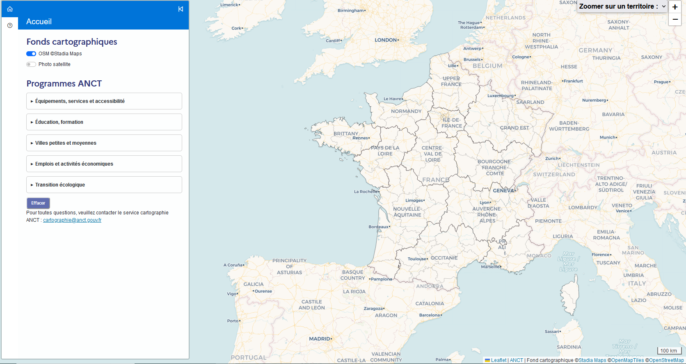

## Carte interactive des programmes de l'ANCT

Page officielle : https://agence-cohesion-territoires.gouv.fr/

Lien direct : https://carto.pages.sit.incubateur.tech/superposeur-anct/

## Présentation

La carte interactive des programmes de l'ANCT recense les dispositifs et programmes accompagnés par l'ANCT pour construire les politiques publiques.

## Fonctionnalités 

- Rechercher, localiser et accéder aux propriétés des programmes ANCT;

## Données

Les données seront diffusées sous licence Ouverte Étalab 2.0 sur la page data.gouv de l'ANCT. 

## Technologies

Cet outil, conçu et développé par le service cartographie de l'ANCT, a été réalisé en HTML/CSS/Javascript et utilise les librairies Leaflet 1.9.4 et l'extension communautaire Leaflet Sidebar, Bootstrap 5.2.0, Line awesome. Le fond cartographique provient d'OpenStreetMap "Stadia Maps" et la photo satellite provient d'ESRI.

## En savoir plus sur les programmes

A MODIFIER :Sur le site de ANCT : https://agence-cohesion-territoires.gouv.fr/territoires-dengagement-territoires-en-commun-528 
